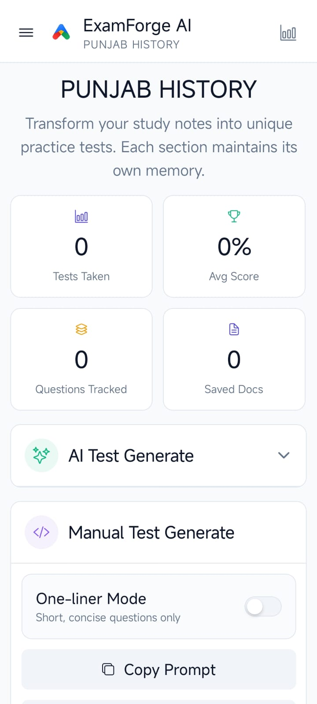
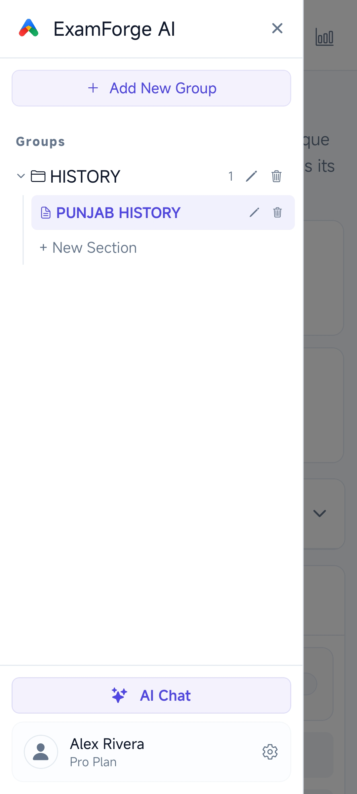
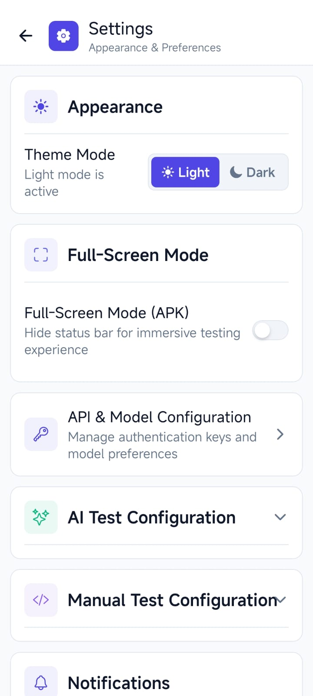
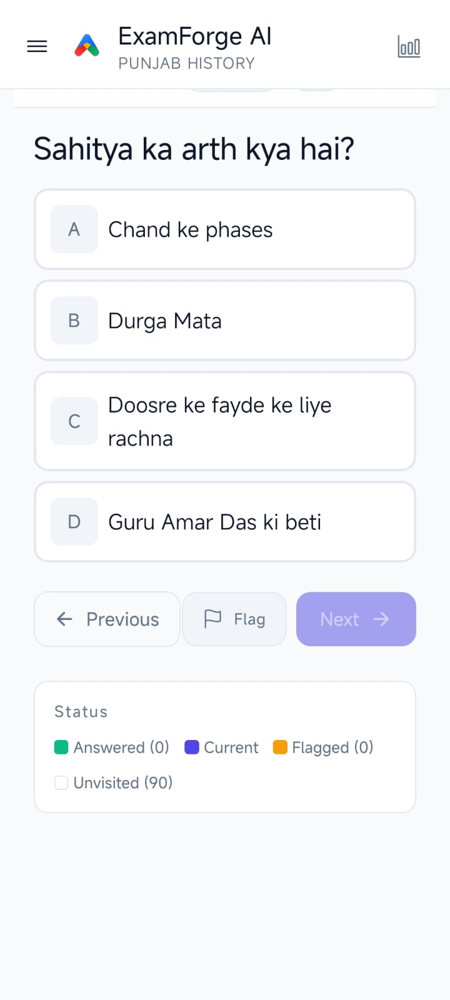
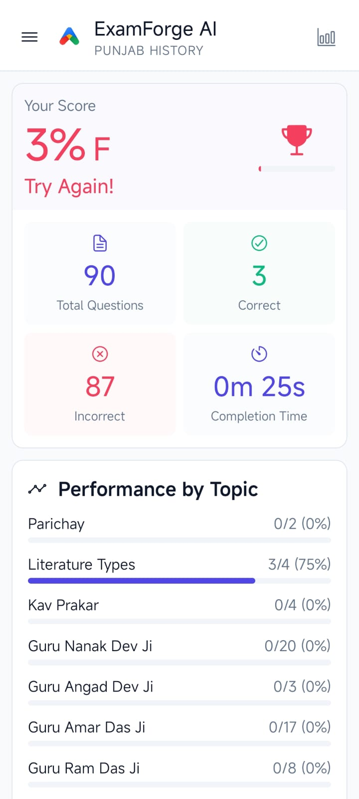
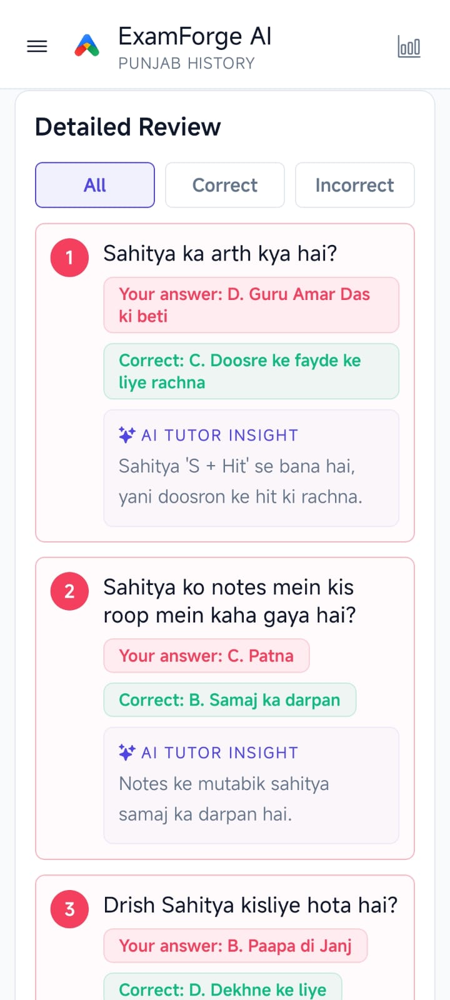
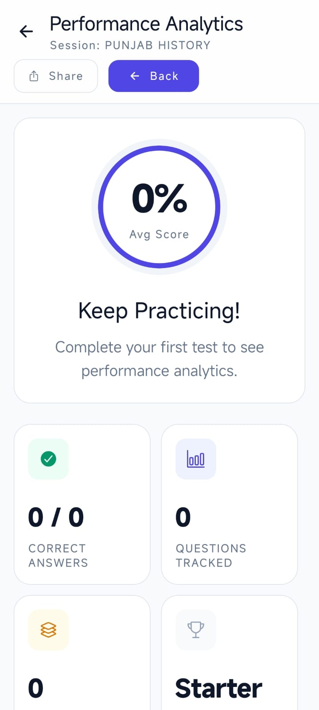
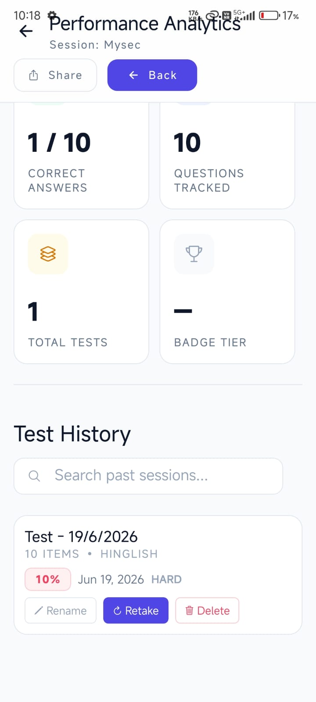
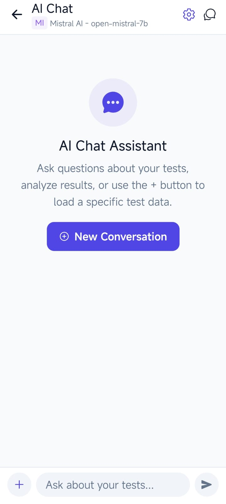

<div align="center">
  
  <h1 align="center"> ExamForge AI</h1>
  <p align="center">
    <strong>AI-Powered Exam Preparation Platform</strong>
    <br />
    Generate custom tests, quizzes, and study materials from your notes, documents, and textbooks using cutting-edge AI models.
    <br />
    <br />
    <a href="#features">Explore Features</a>
    ·
    <a href="#screenshots">Screenshots</a>
    ·
    <a href="#getting-started">Getting Started</a>
    ·
    <a href="#tech-stack">Tech Stack</a>
  </p>
  
  <p align="center">
    
    
    
    
  </p>
</div>

---

## Features

### AI-Powered Test Generation
Generate intelligent, customized tests from your study materials with support for **multiple AI providers** and **50+ AI models**.

| Provider | Models | Features |
|----------|--------|----------|
| **OpenRouter** | 50+ models (GPT-4, Claude, Llama, Mistral, DeepSeek, etc.) | Free tier available, wide model selection |
| **Google Gemini** | Gemini 2.0 Flash, Gemini Pro | Fast, free tier, Google AI expertise |
| **Mistral AI** | Mistral models | Open-source focused, efficient |

- **Smart Question Generation** - AI analyzes your notes, textbooks, and documents to create contextually relevant questions
- **Adjustable Difficulty** - Choose from Easy, Medium, or Hard levels
- **Multi-Language Support** - Generate tests in English, Hindi, or Hinglish
- **One-Liner Mode** - Quick, concise question format for rapid revision
- **Custom Prompts** - Fine-tune AI behavior with custom instructions
- **Question Uniqueness** - Built-in similarity detection prevents duplicate questions

### Document Upload & Processing
- Upload PDF, DOCX, and TXT files for automatic text extraction
- Built-in document parser handles multiple formats seamlessly
- **Saved Documents** - Store and reuse uploaded documents across sessions
- **File Similarity Detection** - Prevents duplicate questions from previously used content
- **Paste Notes Directly** - Quick input option without file upload

### Interactive Quiz Interface
- **Real-time Scoring** - Instant feedback after each answer
- **Question Navigation** - Grid view for quick jumping between questions
- **Flag for Review** - Mark questions to revisit later
- **Timer** - Track time spent on each test
- **Progress Tracking** - Visual progress bar
- **Option to Retry** - Take the same test again to improve

### Detailed Score Reports & Analytics
- **Comprehensive Results** - Score, percentage, and grade (A+ through F)
- **Topic-wise Breakdown** - Understand performance across different topics
- **Detailed Review** - Filter questions by correct/incorrect/all
- **Time Analysis** - Track time taken per test
- **Performance History** - View past test results and track improvement

### AI Chat Assistant
- **Subject Clarification** - Ask AI questions about your study material
- **Context-Aware Conversations** - Chat linked to your tests and sections
- **Multi-Provider Support** - Use any configured AI provider for chat
- **Conversation History** - Save and revisit previous conversations

### Section & Group Management
- **Organize Study Materials** - Create sections and groups for different subjects
- **Saved Questions** - Track question history to prevent repeats
- **Test Results History** - All past tests saved with full details
- **Backup & Restore** - Data management tools with JSON export/import

### Customization & Settings
- **Dark Theme** - Sleek dark interface optimized for extended study sessions
- **Full-Screen Mode** - Distraction-free testing environment
- **API Key Management** - Configure keys for all AI providers
- **Custom Instructions** - Personalized AI response behavior
- **App Logs** - Debug and event logs for troubleshooting

### Manual Test Generation
- Create custom tests by pasting JSON-formatted questions
- Full control over question content, answers, and explanations
- Ideal for educators preparing specific question banks
- Works offline - no API key required

---

## Screenshots

<table>
  <tr>
    <td align="center" width="33%">
      <br/>
      <sub><b> Home Screen</b></sub><br/>
      <sub>Central dashboard with quick access to all features</sub>
    </td>
    <td align="center" width="33%">
      <br/>
      <sub><b> Sidebar Navigation</b></sub><br/>
      <sub>Quick access to sections, groups, and settings</sub>
    </td>
    <td align="center" width="33%">
      <br/>
      <sub><b> Settings</b></sub><br/>
      <sub>Configure AI providers, theme, and app preferences</sub>
    </td>
  </tr>
  <tr>
    <td align="center" width="33%">
      <br/>
      <sub><b> Quiz Interface</b></sub><br/>
      <sub>Interactive multiple-choice quiz with instant feedback</sub>
    </td>
    <td align="center" width="33%">
      <br/>
      <sub><b> Test Results</b></sub><br/>
      <sub>Score, percentage, grade, and performance summary</sub>
    </td>
    <td align="center" width="33%">
      <br/>
      <sub><b> Detailed Review</b></sub><br/>
      <sub>Question-by-question analysis with correct/incorrect filter</sub>
    </td>
  </tr>
  <tr>
    <td align="center" width="33%">
      <br/>
      <sub><b> Performance Analytics</b></sub><br/>
      <sub>Track scores and improvement over time</sub>
    </td>
    <td align="center" width="33%">
      <br/>
      <sub><b> Test History</b></sub><br/>
      <sub>Browse and review all past test attempts</sub>
    </td>
    <td align="center" width="33%">
      <br/>
      <sub><b> AI Chat Assistant</b></sub><br/>
      <sub>Ask questions and clarify concepts with AI</sub>
    </td>
  </tr>
</table>

---

## Getting Started

### Prerequisites
- Node.js (v18 or higher)
- npm or yarn
- Expo CLI (npm install -g expo-cli)
- Android Studio / Xcode (for native builds)
- AI Provider API Key (OpenRouter, Gemini, or Mistral)

### Installation

```bash
git clone https://github.com/Rajasthanichora/exam-forge-ai.git
cd exam-forge-ai
npm install
npx expo start
```

### Configuration
1. Open the app and navigate to **Settings** > **API Settings**
2. Add your API keys for your preferred AI provider(s):
   - OpenRouter (https://openrouter.ai/keys) - Free tier available
   - Google Gemini (https://aistudio.google.com/app/apikey) - Free tier available
   - Mistral AI (https://console.mistral.ai/api-keys/) - Free tier available
3. Select your preferred AI model from the available options
4. Start generating tests from your study materials!

### Build for Production

```bash
npx eas build --platform android --profile production
npx eas build --platform ios --profile production
npx expo export --platform web
```

---

## Tech Stack

| Layer | Technology |
|-------|-----------|
| Framework | React Native + Expo (v56) |
| Language | TypeScript |
| Navigation | Expo Router (file-based routing) |
| State Management | React hooks + AsyncStorage |
| AI Integration | OpenRouter API, Google Gemini, Mistral AI |
| File Processing | Mammoth (DOCX), custom parsers |
| Backend (optional) | Supabase |
| Icons | @expo/vector-icons (Ionicons) |
| UI | Custom dark theme with full theming system |

### Project Structure

```
exam-forge-ai/
  app/                    Expo Router screens
    _layout.tsx           Root layout + navigation
    index.tsx             Home screen (quiz, results, sections)
    settings.tsx          App settings + AI config
    api-settings.tsx      AI provider configuration
    ai-chat.tsx           AI chat assistant
    results-history.tsx   Past test results
  components/             Reusable UI components
    FileUpload.tsx        Document upload handler
    QuizInterface.tsx     Interactive quiz component
    TestConfigForm.tsx    Test configuration form
    TestResults.tsx       Results display + grading
    ManualTestGen.tsx     Manual test creation
  lib/                    Core utilities
    api.ts                AI provider API integration
    types.ts              TypeScript type definitions
    storage.ts            AsyncStorage wrapper
    section-store.ts      Section data management
    file-handler.ts       Document parsing utilities
    score-report.ts       Score report generation
    theme.tsx             Dark theme system
  assets/                 Static assets
  screenshots/            App screenshots
```

---

## License

This project is licensed under the MIT License.

---

<div align="center">
  <p>Made with heart for students everywhere</p>
</div>
